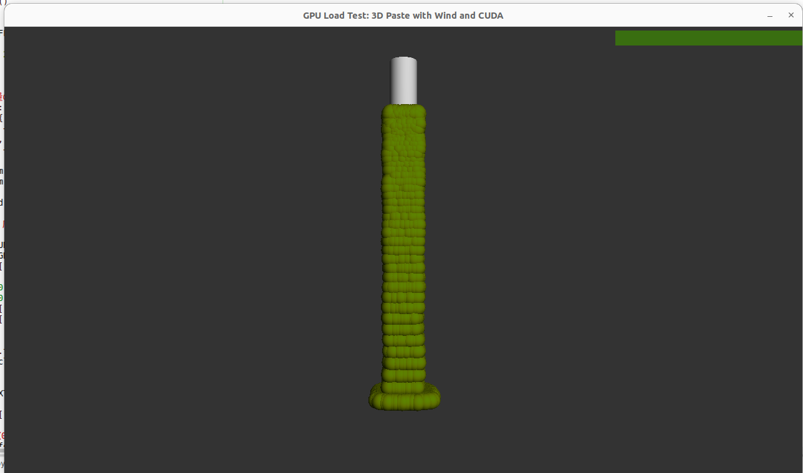

# 3D Paste Benchmark
OpenGL based 3D bench for linux

## concept
This project implements a GPU benchmark for 3D rendering using PyOpenGL and Pygame, combined with CUDA-powered computations via PyTorch. The benchmark simulates a “paste” effect where many textured particles (small spheres) are generated from a tube and accumulate on the ground, while a heavy CUDA task runs in parallel to increase overall GPU load. The benchmark is score-based: after running for a user-specified time, it calculates a score in terms of the number of polygons rendered per second.

# Features

1. Dynamic 3D Scene:
- A tube at the top of the scene emits many textured particles that fall under gravity and spread out horizontally upon reaching the floor. This simulates a “paste” that accumulates over time.

2. Real-time Performance Overlay:
- The window displays real-time statistics (FPS, CPU usage, and GPU usage) in the top-right corner using Pygame’s font rendering.

3. CUDA Load:
- A separate thread continuously performs heavy matrix multiplications using PyTorch on the GPU (CUDA) to boost the GPU’s computational load.

4. Score-based Benchmark:
- The benchmark runs for a user-specified duration (default 60 seconds, configurable via the --time command-line option). It then calculates a score based on the estimated total number of polygons rendered per second.

# Key Parameters
1. PARTICLES_PER_FRAME:
Number of particles (textured spheres) generated every frame. Increase this value to raise rendering load.

2. GRAVITY:
Controls the falling speed of the particles. Adjust this value to affect how quickly particles accumulate.

3. POLYGONS_PER_PARTICLE:
Approximate polygon count per particle (set to 512 based on the tessellation of the sphere). This value is used in the final score calculation.

4. CUDA Matrix Size & Sleep Time:
Inside the CUDA worker function, the size of the matrices (6000×6000 by default) and the sleep interval (0.05 seconds) can be adjusted to change the computational load.

# How to Run

  ## requirement:
        Python 3.x
        Pygame
        PyOpenGL
        PyTorch (with CUDA support)
        GPUtil (optional, for GPU load monitoring)
        NumPy

    - Place your texture image (e.g., texture.jpg) in the same directory as the benchmark script.
    - Run the benchmark from the command line. By default, it runs for 60 seconds:

```
python irotest.py

```

**To run for a different duration (in seconds), use the --time option:**
```
python irotest.py --time 180


```

## Result sample

```

--- BENCHMARK RESULT ---
Total Frames: 3000
Time Elapsed: 60.00 s
Approx. Polygons: 460800000
Score (Polygons/s): 7680000.0

```
# screen sample


